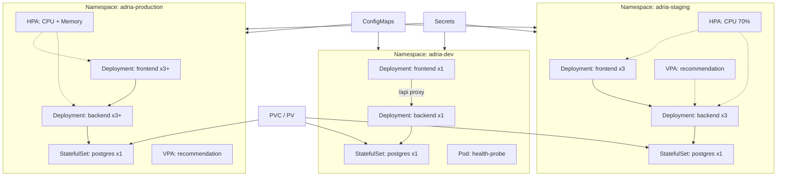

# Adria Reserve — Kubernetes Architecture Summary

**Author:** Leart Saliu (leartt0) | **Repository:** [Containerized-Architecture](https://github.com/leartt0/Containerized-Architecture)

---

## 1. Application Description

**Adria Reserve** is a full-stack travel booking web application consisting of three communicating components:

1. **Frontend** — React + Vite SPA served by Nginx (port 80). Proxies `/api/` to the backend service.
2. **Backend API** — Node.js/Express REST API (port 3001). Handles authentication, property search, reservations, and external Bros Travel API integration.
3. **Database** — PostgreSQL 15 storing users, properties, reservations, and payments.

This satisfies the project requirement of a multi-part web application where components communicate over the network.

---

## 2. Architecture Diagram

---

## 3. Kubernetes Objects and Rationale

| Object | Used For | Why |
| ------ | -------- | --- |
| **Pod** | `adria-health-probe` in dev | Demonstrates bare Pod resource; runs curl sidecar for manual health checks |
| **Deployment** | Frontend, Backend | Stateless tiers; supports rolling updates and replica scaling |
| **StatefulSet** | PostgreSQL | Stable pod name, persistent identity, ordered PVC per replica |
| **Service (ClusterIP)** | Backend, Postgres headless | Internal cluster DNS (`adria-backend`, `adria-postgres`) |
| **Service (NodePort)** | Frontend | External access on Minikube without Ingress |
| **ConfigMap** | App settings (DB host, log level) | Non-sensitive config, easy per-environment overrides |
| **Secret** | DB password, JWT keys | Sensitive values separated from ConfigMaps |
| **PVC** | Backend logs | Persistent log storage across pod restarts |
| **volumeClaimTemplates** | Postgres data in StatefulSet | Each DB pod gets its own persistent volume |
| **ResourceQuota** | Dev (1 CPU), Staging (2 CPU) | Environment resource governance per assignment |
| **LimitRange** | Dev namespace | Caps default container sizes in development |
| **HPA** | Staging + Production | Scales frontend/backend on CPU (and memory in prod) |
| **VPA** | Staging + Production | `updateMode: Off` = recommendation only, no auto-resize |

---

## 4. Environment Isolation

Three **namespaces** provide logical separation:

| | Development | Staging | Production |
|---|-------------|---------|------------|
| **Purpose** | Developer testing | Pre-release validation | Live traffic |
| **Replicas** | 1 per deployment | 3 minimum | 3 minimum (HPA up to 12) |
| **CPU Quota** | 1 core total | 2 cores total | No limit |
| **Images** | `:1.0.0-dev`, postgres:14 | `:1.0.0` stable | `:1.0.0`, pull Always |
| **HPA** | Disabled | CPU 70%, 3–8 pods | CPU 65%, memory 75%, 3–12 pods |
| **VPA** | Not deployed | Recommendation mode | Recommendation mode |
| **NodePort** | 30080 | 30081 | 30082 |

Each namespace has its own Secrets, ConfigMaps, PVCs, and Services — resources cannot cross namespaces without explicit configuration.

---

## 5. Storage Strategy

- **PostgreSQL data** — `volumeClaimTemplates` in StatefulSet (1 Gi dev, 5 Gi staging, 10 Gi production). Survives pod restarts.
- **Backend logs** — standalone PVC mounted at `/app/logs` in backend Deployment.

Minikube uses the `standard` StorageClass which dynamically provisions PersistentVolumes.

---

## 6. Autoscaling

**Horizontal Pod Autoscaler (HPA):** Monitors CPU utilization. When average usage exceeds the target (65–70%), Kubernetes adds pods up to `maxReplicas`. Requires metrics-server (enabled via `minikube addons enable metrics-server`).

**Vertical Pod Autoscaler (VPA):** Configured with `updateMode: "Off"` — the VPA controller analyzes historical usage and **recommends** optimal CPU/memory requests without automatically changing running pods. View with `kubectl describe vpa`.

---

## 7. Testing Instructions

1. `eval $(minikube docker-env) && ./scripts/build-images.sh`
2. `./scripts/deploy-all.sh`
3. `minikube service adria-frontend -n adria-dev --url` → open in browser
4. `kubectl get hpa -n adria-staging` → verify HPA targets
5. `kubectl describe resourcequota -n adria-dev` → verify 1 CPU limit

---

## 8. References

- Adria Reserve application: https://github.com/leartt0/adria-reserve
- Kubernetes documentation: https://kubernetes.io/docs/
- Minikube: https://minikube.sigs.k8s.io/
- Docker Hub images: `leartt0/adria-reserve-backend`, `leartt0/adria-reserve-frontend`
